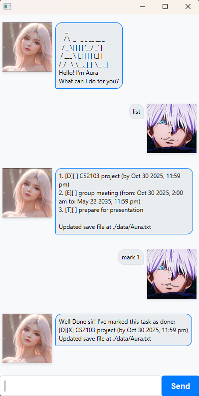

# Aura User Guide

## Table of Contents
1. [Getting Started](#getting-started)
2. [Features](#features)
    - [Adding Tasks](#adding-tasks)
    - [Managing Tasks](#managing-tasks)
    - [Finding Tasks](#finding-tasks)
    - [Exiting the Application](#exiting-the-application)
3. [Command Summary](#command-summary)



Aura is here to help you manage your daily tasks so you will never need to remember them!

## Getting Started

**Quick Start**

1. Ensure you have Java 17 or above installed on your computer.
   - Mac users: Ensure you have the precise JDK version prescribed [here](https://www.jetbrains.com/help/idea/sdk.html#set-up-jdk).
2. Download the latest `aura.jar` file from the releases section.
3. Copy the file to the folder you want to use as the home folder for Aura.
4. Open a command terminal, `cd` into the folder you put the jar file in, and use the following command to run the application:
   ```
   java -jar aura.jar
   ```
5. A GUI similar to the image above should appear in a few seconds.
6. Type your command in the command box and press Enter to execute it. For example, typing `list` and pressing Enter will list all your tasks.

**Some example commands you can try:**
- `list` : Lists all tasks.
- `todo read book` : Adds a ToDo task named "read book".
- `deadline submit assignment /by 2024-03-15 2359` : Adds a deadline task.
- `event project meeting /from 2024-03-10 1400 /to 2024-03-15 1600` : Adds an event task.
- `delete 2` : Deletes the 2nd task shown in the current list.

Refer to the Features below for details of each command.

---

## Features

### Adding Tasks

#### 1. ToDo Tasks
Add a simple task without any time constraints.

**Command:** `todo <description>`

**Example:** `todo read book`

**Expected Output:**
```
Got it. I've added this task:
  [T][ ] read book
Now you have 1 tasks in the list.
```

---

#### 2. Deadline Tasks
Add a task that needs to be completed by a specific date/time.

**Command:** `deadline <description> /by <date-time>`

**Date-Time Format:** `yyyy-MM-dd HHmm` (e.g., 2024-12-25 1800)

**Example:** `deadline submit assignment /by 2024-03-15 2359`

**Expected Output:**
```
Got it. I've added this task:
  [D][ ] submit assignment (by: Mar 15 2024 23:59)
Now you have 2 tasks in the list.
```

---

#### 3. Event Tasks
Add a task that occurs during a specific time period.

**Command:** `event <description> /from <start-date-time> /to <end-date-time>`

**Date-Time Format:** `yyyy-MM-dd HHmm` (e.g., 2024-12-25 1400)

**Example:** `event project meeting /from 2024-03-10 1400 /to 2024-03-15 1600`

**Expected Output:**
```
Got it. I've added this task:
  [E][ ] project meeting (from: Mar 10 2024 14:00 to: Mar 15 2024 16:00)
Now you have 3 tasks in the list.
```

---

### Managing Tasks

#### 1. Viewing All Tasks
Display all tasks in your list with their current status.

**Command:** `list` or `list 1`

- `list` displays all tasks in your list.
- `list 1` displays all deadline tasks sorted by due date.

**Example Output for `list`:**
```
Here are the tasks in your list:
1. [T][ ] read book
2. [D][ ] submit assignment (by: Mar 15 2024 23:59)
3. [E][ ] project meeting (from: Mar 10 2024 14:00 to: Mar 15 2024 16:00)
```

**Example Output for `list 1`:**
```
Here are the tasks in your list:
1. [D][ ] submit assignment (by: Mar 15 2024 23:59)
2. [D][ ] submit homework (by: Mar 18 2024 23:59)
```

If there are no deadline tasks:
```
There are no deadline tasks to display.
```

If an invalid index is given:
```
ERROR: Invalid index given, please enter 1 after a space
```

---

#### 2. Marking Tasks as Done
Mark a task as completed.

**Command:** `mark <task-number>`

**Example:** `mark 1`

**Expected Output:**
```
Well Done sir! I've marked this task as done: 
[T][X] read book
```

---

#### 3. Unmarking Tasks
Mark a task as not completed.

**Command:** `unmark <task-number>`

**Example:** `unmark 1`

**Expected Output:**
```
Alright, I've marked this task as not done: 
[T][ ] read book
```

---

#### 4. Deleting Tasks
Remove a task from your list.

**Command:** `delete <task-number>`

**Example:** `delete 2`

**Expected Output:**
```
Understood Sir, I have removed the task: 
  [D][ ] submit assignment (by: Mar 15 2024 23:59)
Now you have 2 tasks in the list.
```

---

### Finding Tasks

#### Search by Keyword
Find all tasks containing a specific keyword.

**Command:** `find <keyword>`

**Example:** `find book`

**Expected Output:**
```
1. [T][ ] read book
```

If no tasks match:
```
ERROR: Please enter a valid keyword
```

---

### Exiting the Application

#### Say Goodbye
Close the application gracefully.

**Command:** `bye`

**Expected Output:**
```
Bye Bye my friend
```

The application will close after displaying the message.

---

## Command Summary

| Action   | Format & Example |
|----------|------------------|
| Add ToDo | `todo <description>`<br>e.g., `todo read book` |
| Add Deadline | `deadline <description> /by <yyyy-MM-dd HHmm>`<br>e.g., `deadline submit assignment /by 2024-03-15 2359` |
| Add Event | `event <description> /from <yyyy-MM-dd HHmm> /to <yyyy-MM-dd HHmm>`<br>e.g., `event project meeting /from 2024-03-10 1400 /to 2024-03-15 1600` |
| List Tasks | `list` or `list 1`<br>e.g., `list` or `list 1` |
| Mark Task as Done | `mark <task-number>`<br>e.g., `mark 1` |
| Unmark Task | `unmark <task-number>`<br>e.g., `unmark 1` |
| Delete Task | `delete <task-number>`<br>e.g., `delete 2` |
| Find Tasks | `find <keyword>`<br>e.g., `find book` |
| Exit | `bye` |
